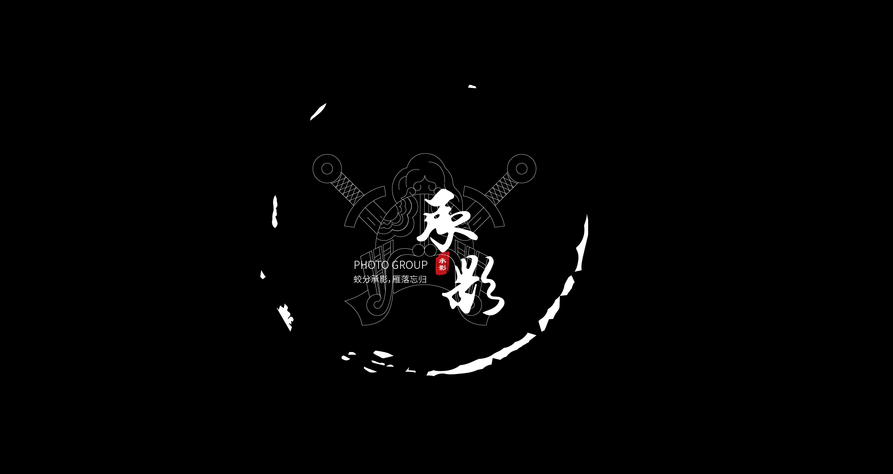

> Hello 陌生人，欢迎访问 承影攻防实验室 Blog

承影攻防实验室是一个持续学习发展中网络安全研究团队，成立于2021年7月16日，由一群热爱网络安全的年轻人一同组成，致力于研究红队攻防、漏洞挖掘与修复等，不定期的分享，接收各种批评与建议，一起共同学习成长！该博客托管于 GitHub Page，主题是Tmaize写的，见[tmaize-blog](https://github.com/TMaize/tmaize-blog)，喜欢的话可以给个小星星。

## 相关技能

- web渗透测试

- 内网渗透测试

- APP渗透测试

- 红蓝对抗攻防演练

- 还有很多xxxxxx技能

## 联系我

- QQ&nbsp;&nbsp;&nbsp;&nbsp;: xxxxxx

- Email&nbsp;: [chengying@bugbank.cn](chengy1ng@bugbank.cn)

- GitHub: [chengy1ng](https://github.com/chengy1ng)
